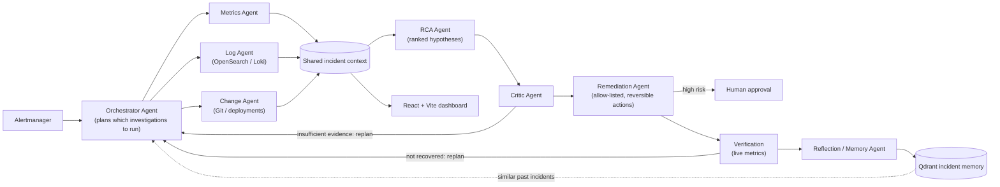

# AIRA: mid-semester architecture

This document describes **what is built and running now**, then, in a separate section, what comes
next. Every component in the first diagram exists in this repository and was verified with real
faults on 2026-10-06.

## 1. What is built now

```mermaid
flowchart LR
    subgraph Demo["OpenTelemetry Demo 3.1.0 (Docker, 28 containers)"]
        LG["Locust load generator<br/>(real user traffic)"] --> FP["frontend-proxy (Envoy :8080)"]
        FP --> FE["frontend"]
        FE --> SVC["cart · checkout · payment · product-catalog<br/>recommendation · ad · currency · shipping · ..."]
        FLAGD["flagd<br/>(feature flags)"] -. fault injection .-> SVC
    end

    SVC -- "OTLP traces, metrics, logs" --> COL["OTel Collector<br/>span_metrics (15s) + docker_stats (10s)"]
    COL -- traces --> JAE["Jaeger"]
    COL -- "OTLP metrics push" --> PROM["Prometheus :9090"]
    PROM --> GRAF["Grafana"]

    subgraph AIRAinfra["AIRA infrastructure (infra/)"]
        RULES["alert-rules.yml<br/>AiraHighErrorRate · AiraOperationFailing<br/>AiraHighCpu · AiraServiceDown"]
        AM["Alertmanager :9093"]
    end
    PROM -- "evaluates every 15s" --> RULES
    RULES -- "firing / resolved" --> AM

    subgraph Backend["AIRA backend (FastAPI :8000, host)"]
        WH["POST /alerts<br/>(webhook receiver)"]
        DB[("SQLite<br/>incidents + webhook log")]
        PT["Prometheus tool<br/>(deterministic PromQL)"]
        TA["CrewAI Triage Agent"]
        UI["GET /  Incident Console"]
    end
    AM -- "webhook via host.docker.internal" --> WH
    WH --> DB
    WH -- "background task" --> PT
    PT -- "live queries" --> PROM
    PT --> TA
    TA -- "OpenAI-compatible API" --> OLL["Ollama :11434<br/>qwen2.5:7b-instruct (local GPU)"]
    TA -- "validated JSON (Pydantic)" --> DB
    DB --> UI

    SCRIPTS["scripts/inject-fault.ps1<br/>flagctl.py"] -- "flagd-ui API / docker stop" --> FLAGD
```

### Data flow for one incident

1. **Fault:** `inject-fault.ps1` changes a flag through the flagd-ui API (or stops a container).
   `flagctl.py` asks flagd itself which variant it is now serving, confirming the fault is live.
2. **Signals:** services export spans and metrics over OTLP. The collector turns spans into
   `traces_span_metrics_*` (request rate, errors, latency per service and operation) and reads container
   CPU and memory from the Docker socket.
3. **Detection:** Prometheus evaluates the four AIRA rules every 15 s. Each rule has a short `for:`
   (15–30 s) so an alert is pending first, then firing.
4. **Notification:** Alertmanager groups by `alertname` + `service_name` and posts its standard webhook
   (payload version 4) to `http://host.docker.internal:8000/alerts`, including `resolved` notifications.
5. **Incident:** the backend logs the raw payload and creates one incident per alert instance
   (fingerprint + `startsAt`). A `resolved` notification updates the same incident.
6. **Evidence:** a background task runs the Prometheus tool for the alert's `service_name`: request rate,
   error ratio, p95 latency, container CPU and memory, the time since the container last reported, the top
   failing operations, and a 15–25-minutes-ago baseline for each. A missing value is written as
   "unavailable".
7. **Triage:** the CrewAI Triage Agent (one agent, one task) receives the alert and the evidence text. It
   must answer with JSON containing `summary`, `affected_service`, `observed_symptoms`,
   `likely_cause_category`, `suggested_next_investigation` and `confidence`. Pydantic validates the
   answer. Invalid output gets one retry with the validation error; a second failure is stored as an
   error state. Runs are serialised (one at a time) and time out after 180 s.
8. **Console:** `GET /` polls `GET /incidents` every 3 s and shows status, times, evidence and the
   agent's summary.

### Key design decisions

| Decision | Reason |
|---|---|
| Upstream demo never edited; AIRA changes live in `infra/` | Reproducible, easy to upgrade, and it is clear what we built and what upstream built |
| Prometheus config is a copy of upstream plus `rule_files` and `alerting`, mounted by our compose override | Prometheus has no include mechanism for these sections |
| Span metrics for request rate, errors and latency | The only RED metrics emitted uniformly by every service (Go, Java, .NET, Node, Python, ...) |
| CPU from the rate of `container_cpu_usage_nanoseconds_total` | The `container_cpu_utilization_ratio` gauge lagged far behind reality (measured) |
| "Service down" = a container that reported in the last 30 min but not in the last 45 s | Services push OTLP, so there is no `up` metric; docker_stats reports every running container every 10 s |
| Long-lived `*/EventStream` spans excluded from error rules | They end in error when a client disconnects (caused a false flagd alert) |
| Prometheus tool is plain Python, not an LLM tool call | Numbers must be exact and repeatable; the LLM only interprets them |
| Agent output is JSON validated by Pydantic | A structured result can be stored, displayed and later evaluated |
| Local model on Ollama (qwen2.5:7b-instruct, 4.7 GB) | Zero cost and private. Fits fully in 8 GB of GPU memory: about 7–10 s per triage |
| SQLite | Single file, no extra service, enough for a prototype |

### Components and versions

| Component | Version | Where |
|---|---|---|
| OpenTelemetry Demo | 3.1.0 | `opentelemetry-demo/` (upstream) |
| OTel Collector contrib | 0.159.0 | demo |
| Prometheus | 3.13.1 | demo + `infra/prometheus/` |
| Alertmanager | 0.34.1 | `infra/compose.aira.yaml` |
| FastAPI / Uvicorn | 0.142.2 / 0.54.0 | `backend/` |
| CrewAI | 1.15.23 | `backend/` |
| Ollama / model | 0.9.6 / qwen2.5:7b-instruct (Q4_K_M) | host |

## 2. What comes next (not built yet)

These follow the project synopsis and timeline. None of them exists in the code yet.

| Next step | Builds on what exists now |
|---|---|
| Orchestrator Agent with dynamic task selection | The Triage Agent's `suggested_next_investigation` and `likely_cause_category` become its planning input |
| Metrics Agent | Wraps the existing Prometheus tool; adds traces from Jaeger's API |
| Log Agent | Demo logs already go to OpenSearch; the synopsis plans Loki, to be decided |
| Change Agent | Git history plus container image/version changes (`service_version` label) |
| RCA + Critic Agents, with a replanning loop | Uses the shared incident context in SQLite |
| Remediation Agent with an allow-list (restart container, reset flag, scale) and human approval | `inject-fault`/`clear-fault` already show the reversible action primitives |
| Verification loop | The same alert rules and Prometheus tool decide "recovered or not" |
| Reflection / Memory with Qdrant | Stored incidents (evidence + outcome) become the retrieval corpus |
| React + Vite dashboard | Replaces the preview console and uses the same `/incidents` API |
| Evaluation: rule baseline vs single LLM vs AIRA without Critic vs full AIRA | `measure_alerts.py` already records repeatable fault timings |
